# Real-Time Text Analysis Technical Specification

## System Architecture Overview

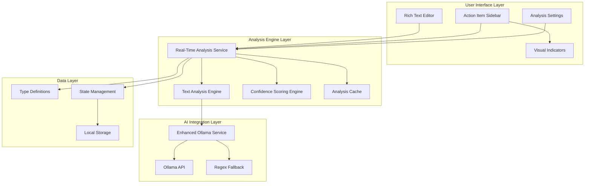

## Real-Time Analysis Flow

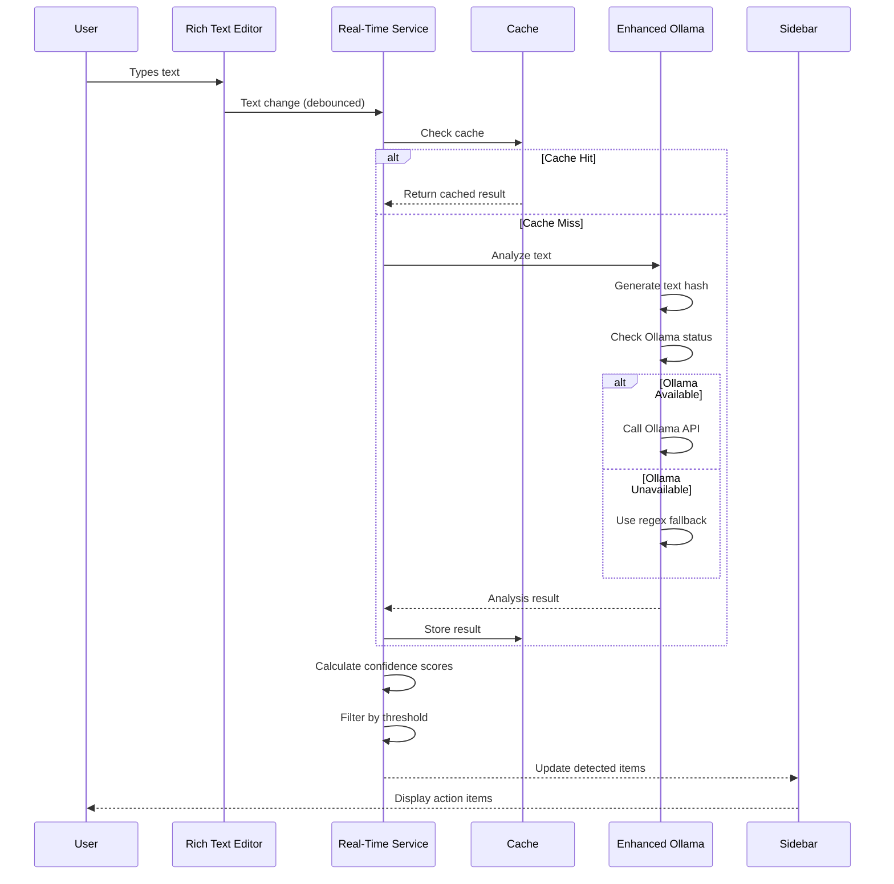

## Component Architecture

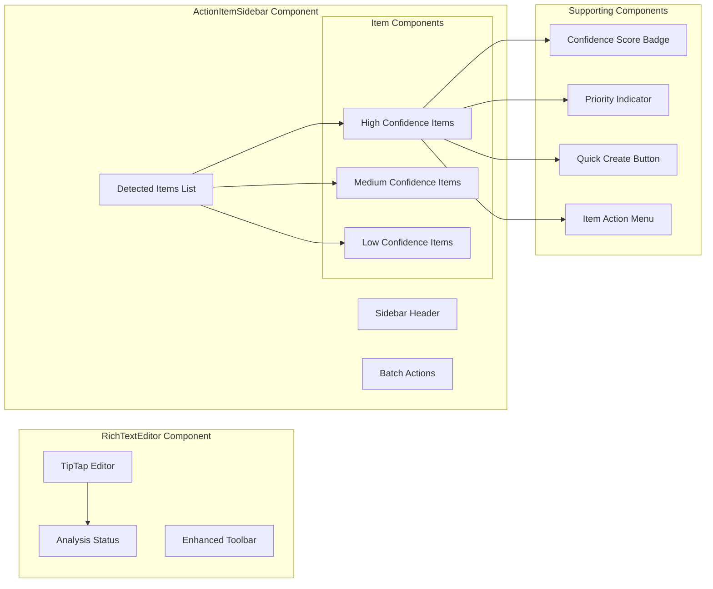

## Data Flow Architecture

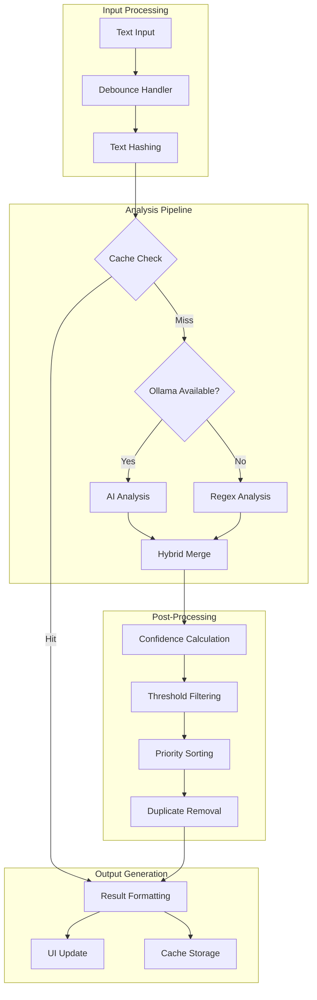

## Detection Pattern Hierarchy

```mermaid
graph TB
    subgraph "Pattern Categories"
        Imperative[Imperative Language]
        Temporal[Temporal References]
        Assignment[Assignment Patterns]
        Commitment[Commitment Phrases]
        Keywords[Task Keywords]
    end

    subgraph "Imperative Patterns"
        I1[need to / needs to]
        I2[should / must / have to]
        I3[implement / fix / create]
        I4[add / remove / update]
    end

    subgraph "Temporal Patterns"
        T1[by Friday / due tomorrow]
        T2[deadline / before]
        T3[Date patterns YYYY-MM-DD]
        T4[Time expressions]
    end

    subgraph "Assignment Patterns"
        A1[@username mentions]
        A2[assign to / assigned to]
        A3[responsible for]
        A4[owner / assignee]
    end

    subgraph "Commitment Patterns"
        C1[I will / we will]
        C2[promise to / commit to]
        C3[guarantee / ensure]
        C4[take responsibility]
    end

    subgraph "Keyword Patterns"
        K1[TODO / FIXME]
        K2[ACTION / TASK]
        K3[NOTE / REMINDER]
        K4[FOLLOW-UP]
    end

    Imperative --> I1
    Imperative --> I2
    Imperative --> I3
    Imperative --> I4

    Temporal --> T1
    Temporal --> T2
    Temporal --> T3
    Temporal --> T4

    Assignment --> A1
    Assignment --> A2
    Assignment --> A3
    Assignment --> A4

    Commitment --> C1
    Commitment --> C2
    Commitment --> C3
    Commitment --> C4

    Keywords --> K1
    Keywords --> K2
    Keywords --> K3
    Keywords --> K4
```

## Confidence Scoring Algorithm

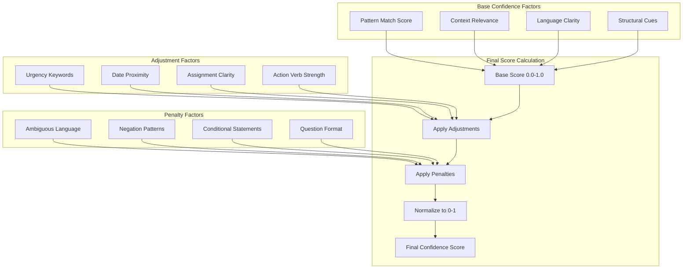

## Performance Optimization Strategy

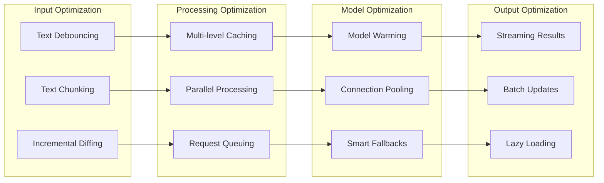

## Error Handling Flow

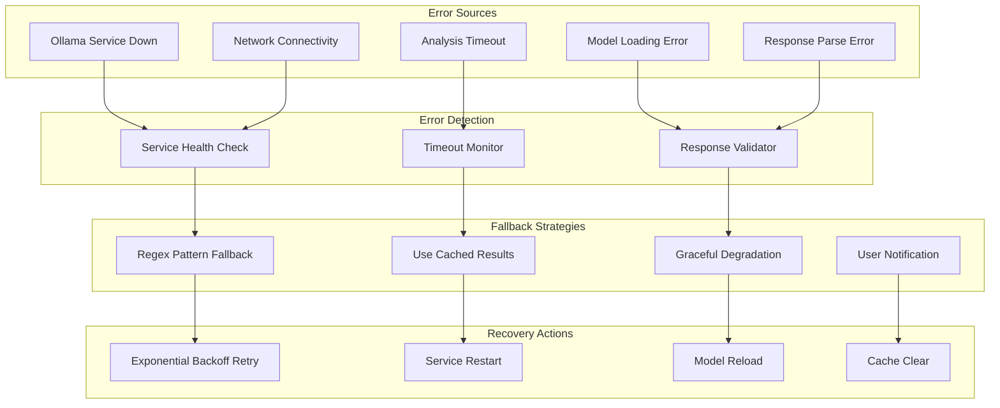

## State Management Architecture

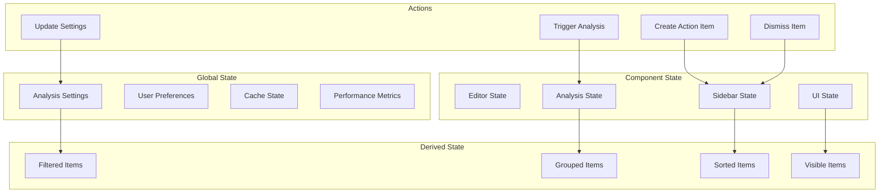

## Integration Points with Existing System

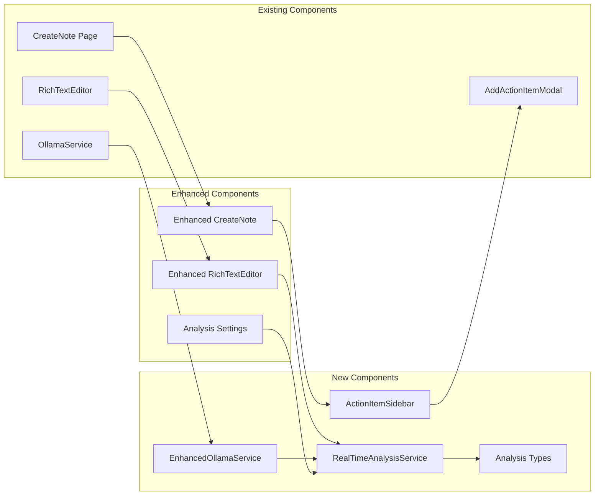

## Performance Monitoring Dashboard

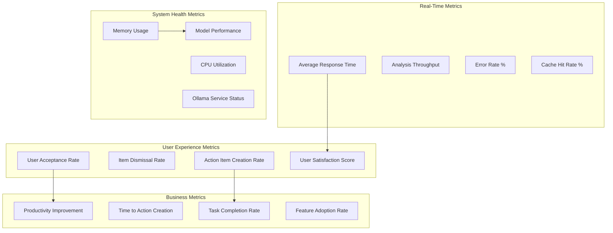

## Security and Privacy Considerations

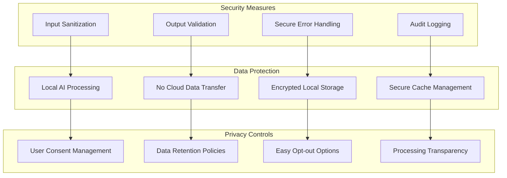

This technical specification provides a comprehensive blueprint for implementing the real-time text analysis system with detailed architectural diagrams, data flows, and integration strategies that maintain the existing system's integrity while adding powerful new capabilities.
